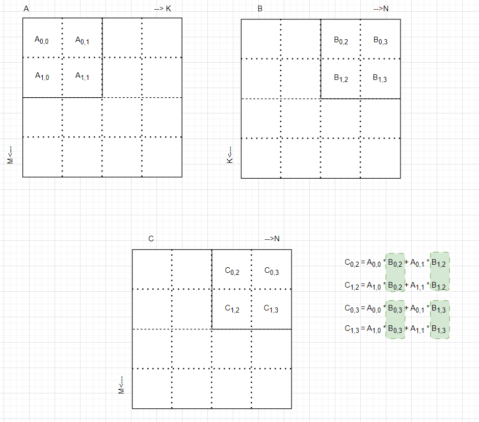
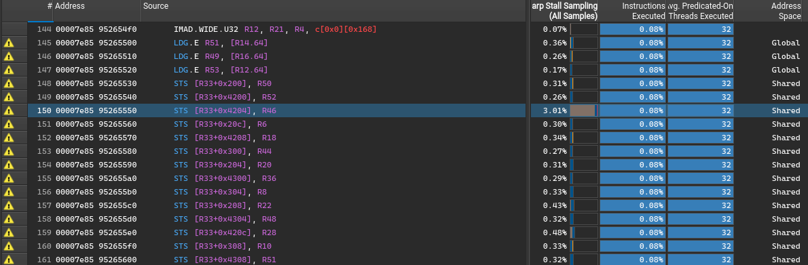
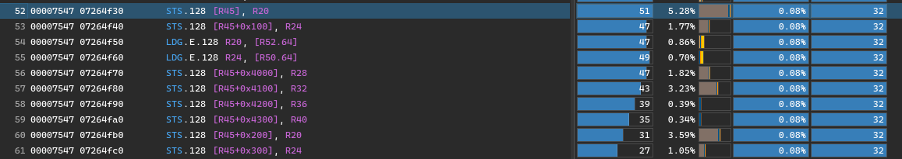
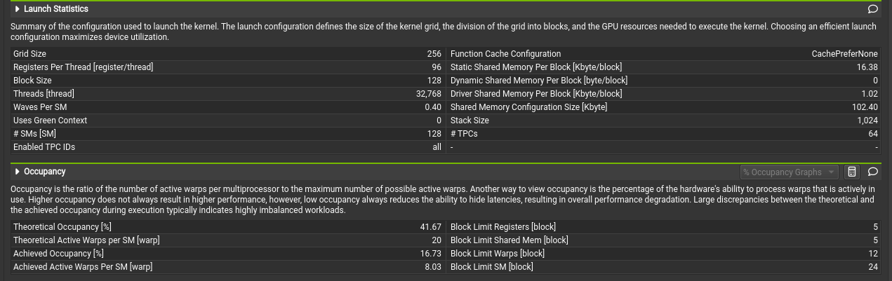
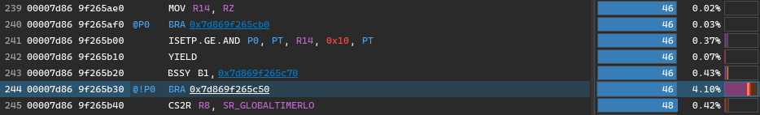

# Perf tune the Matrix Multication in CUDA. 

Let's continue to perf tune our matmul to see how fast it can go. This second part will touch on the topics of 
- Compute intensity
- Vectorization
- Double Buffering
- Async memory copy

It gives a step-by-step demo on how to iterate for better code for CUDA.

## Intuition
When the tile is in the shared memory, it is much faster (25+x) to acess compared to the global mem, however it still takes 20-30 cycles to load. It is critical to utilize registerfiles in the SM whenever it is possible. 

Let's look at how we are calcuating one element in the C matrix in one iteration of tile. 

```cuda
        for (int k = 0; k < TILE_COLS; k++) {
            sum += sharedA[ty][k] * sharedB[k][tx];
        }
```

Notice that for one element, we need to move across the entire row in sharedA, and the entire column in sharedB. This is rather inefficient as the next thread that is working on the element next row, but the same coloumn is reading the same column from sharedB. 

Here is how it works with the curent version. The elements in green are the same elements from sharedB tile that is repeated loaded by different threads. 

To reduce the smem load, and to increase compute intensity, we can load once and save it to the register file. Here is the code change:

```cuda
        for (int k = 0; k < TILE_SIZE; ++k){
            float tmpB = sharedB[k][tx];
            for (uint resIdx = 0; resIdx < ROWS_PER_THREAD; ++resIdx) {
                threadResults[resIdx] +=
                    sharedA[(ty * ROWS_PER_THREAD + resIdx)][k] * tmpB;
            }
        } 
```

The new version is in [matmul_multi_row_per_thread.cu](./matmul_multi_row_per_thread.cu). Every thread now calculate ROWS_PER_THREAD rows, that saves ROWS_PER_THREAD-1 trips to smem by the other threads that are working on the same column but different rows.

The performance increease by this change is amazing. Since we addressed one major bottleneck, the runtime dropped to 101.6 microsecond. 

| CPU/GPU | M    | N    | K    | TILE_SIZE | ROWS_PER_THREAD | Runtime(ms) |
|---------|------|------|------|-----------|-----------------|-------------|
| C       | 1024 | 1024 | 1024 | n/a       |                 | 2368233     |
| G       | 1024 | 1024 | 1024 | 64        | 8               | 101.6       |

## Mini Tiles
Encouraged by the previous success, let's do more to increase the compute intensity. Why should we stop at calculating multiple rows for a thread after all? We can actually calcualte a mini tile per thread. Here is the code snippet. Compiler will use register files for the fragA and fragB arrays, so the smem loads are reduced even further. 

```cuda
        float fragA[MINI_TILE_SIZE];
        float fragB[MINI_TILE_SIZE];

#pragma unroll
        for(int k=0; k < TILE_SIZE; ++k) {
            for(int i=0; i < MINI_TILE_SIZE; i++) {
                fragA[i] = sharedA[inner_row_A + i][k];
            }
            for(int j=0; j < MINI_TILE_SIZE; j++) {
                fragB[j] = sharedB[k][inner_col_B + j];
            }
            for(int i=0; i < MINI_TILE_SIZE; ++i) {
                for(int j=0; j < MINI_TILE_SIZE; ++j) {
                    threadResults[i][j] += fragA[i] * fragB[j];
                }
            }
        } 
```

With the improved code, we see further improved performance.

| CPU/GPU | M    | N    | K    | TILE_SIZE | ROWS_PER_THREAD | MIN_TILE_SIZE | Runtime(ms) |
|---------|------|------|------|-----------|-----------------|---------------|-------------|
| C       | 1024 | 1024 | 1024 | n/a       |                 |               | 2368233     |
| G       | 1024 | 1024 | 1024 | 64        | 8               |               | 101.6       |
| G       | 1024 | 1024 | 1024 | 64        |                 | 4             | 82.3        |

Full code is in [matmul_mini_tile_per_thread](./matmul_mini_tile_per_thread.cu)

## Profile and Analysis
Profiling has shown the we are no longer bottlenecking on the compute, since we are mostly computing from the register files. Instead the warp has been stalling on smem storing from global memory.  


The two biggest warp stall sources are 'short scoreboard' and 'MIO throttle'. This is basically tell us our smem loader isn't efficient. When we load from gmem and store into smem, it is stalling the warps. 

Our loader is reading float by float from global memory into shared memory.

```cuda
    for (int tile = 0; tile < K / TILE_SIZE; ++tile) {
        for(int i = 0; i < MINI_TILE_SIZE; ++i){
            for(int j=0; j< MINI_TILE_SIZE; ++j){
                sharedA[ty * MINI_TILE_SIZE + i][tx * MINI_TILE_SIZE + j] =
                    A[(row + i) * K + tile * TILE_SIZE + tx * MINI_TILE_SIZE + j];
                sharedB[ty * MINI_TILE_SIZE + i][tx * MINI_TILE_SIZE + j] =
                    B[(tile * TILE_SIZE + ty * MINI_TILE_SIZE + i) * N + col + j];
            }
        }
```
Deep dive into the SASS code and we can see clearly that it is loading float by float (4 bytes or 32-bit), and we can't blame on the compiler, that's what our code tells it to do anyways. 



## Matrix Reloaded/Vectorization 
No pun intended. Instead of loading it float by float, we vectorize it and load 4 floats in a row. This way when the compiler compiles into the SASS, it will use the SASS instruction STS.128 instead of STS. 

```cuda
        int global_offset_A = row * K + tile * TILE_SIZE + inner_col_A;
        int global_offset_B = (tile * TILE_SIZE + inner_row_B) * N + col;     

        for(int i = 0; i < MINI_TILE_SIZE; i++){
            for(int j = 0; j < MINI_TILE_SIZE; j+=4){
                reinterpret_cast<float4 *>(&sharedA[inner_row_A + i][inner_col_A + j])[0] = 
                    reinterpret_cast<float4 *>(&A[global_offset_A + j])[0];                

                reinterpret_cast<float4 *>(&sharedB[inner_row_B + i][inner_col_B + j])[0] = 
                    reinterpret_cast<float4 *>(&B[global_offset_B + j])[0];   
            }
            global_offset_A += K;
            global_offset_B += N;         
        } 
```

And Nsight Compute confirms we have the STS.128 instructions. 

As expected performance improved further to 64.3 microsecond. A huge gain!

| CPU/GPU | M    | N    | K    | TILE_SIZE | ROWS_PER_THREAD | MIN_TILE_SIZE | Vectorize | Runtime(ms) |
|---------|------|------|------|-----------|-----------------|---------------|-----------|-------------|
| C       | 1024 | 1024 | 1024 | n/a       |                 |               |           | 2368233     |
| G       | 1024 | 1024 | 1024 | 64        | 8               |               | No        | 101.6       |
| G       | 1024 | 1024 | 1024 | 64        |                 | 4             | No        | 82.3        |
| G       | 1024 | 1024 | 1024 | 64        |                 | 4             | Yes       | 64.3        |

Full code is in[matmul_vectorize.cu](./matmul_vectorize.cu)

## A Blancing Act 
Where to go from here? One idea is to increase the MINI_TILE_SIZE. Obviously if we increase the MINI_TILE_SIZE, we are caching more data in the registerfiles, so we can speed up the compute. But on the other hand, if one thread is calculating more elements, we need to increase the tile size as well, so we can maintain the sweet spot of block size of 128-256 threads. 

To maintain the block size of 256, for example, with a MINI_TILE_SIZE of 8, the TILE_SIZE would be sqrt(8*8*256)=128. Shared memroy is within the scope of a block, and by default the limit on a block is 48K smem. I found the compiler won't allow me to load that big of an array into smem. 

We need to make the tiles rectangular so they fit into the shared memory. The main change in the code is our smem loader. We introducng some guards around the columns on sharedA, and rows on sharedB, and only load it when they are in the bounds.

```cuda
        for(int i = 0; i < MINI_TILE_ROWS; i++){
            for(int j = 0; j < MINI_TILE_COLS; j+=4){
                if(inner_col_A + j + 3 < TILE_COLS_A){
                    reinterpret_cast<float4 *>(&sharedA[inner_row_A + i][inner_col_A + j])[0] = 
                        reinterpret_cast<float4 *>(&A[global_offset_A + j])[0];                      
                }

                if(inner_row_B + i < TILE_ROWS_B){
                    reinterpret_cast<float4 *>(&sharedB[inner_row_B + i][inner_col_B + j])[0] = 
                        reinterpret_cast<float4 *>(&B[(tile * TILE_ROWS_B + inner_row_B + i) * N + col + j])[0];   
                }
            }
            global_offset_A += K;
            global_offset_B += N;         
        }        
```
Full code is [matmul_rectangular_tile.cu](./matmul_rectangular_tile). And tests show a slight perf improvment. Runtime drops to 63.8ms.

| CPU/GPU | M    | N    | K    | TILE_SIZE       | ROWS_PER_THREAD | MIN_TILE_SIZE | Vectorize | Runtime(ms) |
|---------|------|------|------|-----------------|-----------------|---------------|-----------|-------------|
| C       | 1024 | 1024 | 1024 | n/a             |                 |               |           | 2368233     |
| G       | 1024 | 1024 | 1024 | 64              | 8               |               | No        | 101.6       |
| G       | 1024 | 1024 | 1024 | 64              |                 | 4             | No        | 82.3        |
| G       | 1024 | 1024 | 1024 | 64              |                 | 4             | Yes       | 64.3        |
| G       | 1024 | 1024 | 1024 | 64x32 and 32x64 |                 | 8x4           | Yes       | 63.8        |

The perf gain isn't as big as I expected. The benefits we have by putting more data into the registerfiles, is kind of offset by the fact that now we are using more registers/thread, we have less active warps to hide the memory latency. You can see in the profiling details. Registers/Thread rose to 96, and Block limits due to registers dropped to 5. Achieved active warps/SM dropped to 8.03. 

Achieved active warps/SM is important as we have 4 warp schedulers/SM on my RTX 4090, which means max of 4 instructions can be issued per cycle. It is recommended to maintain 8+ active warps so those 4 instructions can be picked up and executed. Otherwise we are likely to see a lot more warp stalls. 



## Double buffering
In previous iteration, our kernel of rectangular tile is most often stuck on the STS.128 instructions. That's to store 128 bits (4 floats) into smem. And that's because we don't have many active warps running to hide the latency. Sure it is much better to stall on the STS.128 instruction than on a STS, but still is there a way to hide the latency?  


Double buffering is a technique that one can use for that purpose. We can maintain two buffers of sharedA and sharedB. Our compute block can work on the ready buffer, while our loader works on geting the next buffer ready. 

The code looks like this. We alternate between the loading buffer and the reading buffer to give threads more leeway in what they are doing. Notice there is no syncing between the loader and our computer. This allows different threads to either load or do their compute in the same time. Full code can be found [matmul_double_buffer.cu](./matmul_double_buffer.cu)

```cuda
#pragma unroll
    for (int tile = 1; tile < num_tiles; ++tile) {
        int read_idx = buffer_idx;
        buffer_idx = 1 - buffer_idx; // Flips between 0 and 1
        //issue_load(A, B, &(sharedA[buffer_idx][0][0]), &(sharedB[buffer_idx][0][0]), tile, tid, load_threads, K, N);
        issue_load(A, B, &(sharedA[buffer_idx][0][0]), &(sharedB[buffer_idx][0][0]), tile, 
            row, col, inner_row_A, inner_col_A, inner_row_B, inner_col_B, K, N);
        // No __syncthreads() here yet! Computation starts immediately.
        
#pragma unroll
        for(int k=0; k < TILE_COLS_A; ++k) {
            for(int i=0; i < MINI_TILE_ROWS; i++) {
                fragA[i] = sharedA[read_idx][inner_row_A + i][k];
            }
            for(int j=0; j < MINI_TILE_COLS; j++) {
                fragB[j] = sharedB[read_idx][k][inner_col_B + j];
            }
            for(int i=0; i < MINI_TILE_ROWS; ++i) {
                for(int j=0; j < MINI_TILE_COLS; ++j) {
                    threadResults[i][j] += fragA[i] * fragB[j];
                }
            }
        }
        
        __syncthreads(); 
    }

```

And we see a slight increase in performance on this iteration. The runtime drops to 62.8ms. 

| CPU/GPU | M    | N    | K    | TILE_SIZE       | ROWS_PER_THREAD | MIN_TILE_SIZE | Vectorize | Double Buffer | Runtime(ms) |
|---------|------|------|------|-----------------|-----------------|---------------|-----------|---------------|-------------|
| C       | 1024 | 1024 | 1024 | n/a             |                 |               |           |               | 2368233     |
| G       | 1024 | 1024 | 1024 | 64              | 8               |               | No        | No            | 101.6       |
| G       | 1024 | 1024 | 1024 | 64              |                 | 4             | No        | No            | 82.3        |
| G       | 1024 | 1024 | 1024 | 64              |                 | 4             | Yes       | No            | 64.3        |
| G       | 1024 | 1024 | 1024 | 64x32 and 32x64 |                 | 8x4           | Yes       | No            | 63.8        |
| G       | 1024 | 1024 | 1024 | 64x32 and 32x64 |                 | 8x4           | Yes       | Yes           | 62.8        |

## Async Copy
Double Buffering proves to work to a degree to hide the memory latency, but the improvement is modest. One would naturally think Async memory load would help further. Good news is that Ampere and later archiecture introduced Async memory copy, which seems to fit to solve our problem. 

Our main loop looks like what we have for Double Buffering, and the main change is in how we load from gmem. Instead of a float4 load and store, we now call the cuda::memcpy_async to do the trick. 

```cuda
__device__ __forceinline__  void issue_load(
    float* A, float* B, float* dstA_tile, float* dstB_tile, 
    int tile_idx, cuda::barrier<cuda::thread_scope::thread_scope_block>& barrier, 
    int tid, int stride, int K, int N) {

    const int v_K = K / 4;
    const int v_N = N / 4;
    const int v_T_COLS_A = TILE_COLS_A / 4;
    const int v_T_COLS_B = TILE_COLS_B / 4;

    float4* srcA = (float4*)&A[blockIdx.y * TILE_ROWS_A * K + tile_idx * TILE_COLS_A];
    float4* srcB = (float4*)&B[tile_idx * TILE_ROWS_B * N + blockIdx.x * TILE_COLS_B];

    #pragma unroll
    for (int i = tid; i < (TILE_ROWS_A * v_T_COLS_A); i += stride) {
        int row_in_tile = i / v_T_COLS_A; 
        int col_in_tile = i % v_T_COLS_A;

        float4* current_srcA = srcA + (row_in_tile * v_K) + col_in_tile;
        cuda::memcpy_async((float4*)dstA_tile + i, current_srcA, 16, barrier);
    }

    #pragma unroll
    for (int i = tid; i < (TILE_ROWS_B * v_T_COLS_B); i += stride) {
        int row_in_tile = i / v_T_COLS_B;
        int col_in_tile = i % v_T_COLS_B;

        float4* current_srcB = srcB + (row_in_tile * v_N) + col_in_tile;
        cuda::memcpy_async((float4*)dstB_tile + i, current_srcB, 16, barrier);
    }
}
```

I had high hopes for this iteration, but the results turned out to be a bit disappointing. Perf regressed to 73.4ms. 

| CPU/GPU | M    | N    | K    | TILE_SIZE       | ROWS_PER_THREAD | MIN_TILE_SIZE | Vectorize | Double Buffer | Async Copy | Runtime(ms) |
|---------|------|------|------|-----------------|-----------------|---------------|-----------|---------------|------------|-------------|
| C       | 1024 | 1024 | 1024 | n/a             |                 |               |           |               |            | 2368233     |
| G       | 1024 | 1024 | 1024 | 64              | 8               |               | No        | No            |            | 101.6       |
| G       | 1024 | 1024 | 1024 | 64              |                 | 4             | No        | No            |            | 82.3        |
| G       | 1024 | 1024 | 1024 | 64              |                 | 4             | Yes       | No            |            | 64.3        |
| G       | 1024 | 1024 | 1024 | 64x32 and 32x64 |                 | 8x4           | Yes       | No            |            | 63.8        |
| G       | 1024 | 1024 | 1024 | 64x32 and 32x64 |                 | 8x4           | Yes       | Yes           | No         | 62.8        |
| G       | 1024 | 1024 | 1024 | 64x32 and 32x64 |                 | 8x4           | Yes       | Yes           | Yes        | 73.4        |

A lot of warp stalls happen at waiting for the barrier. Nsight gives us the instructions it is stalled on: 



That is our async_barrier0->arrive_and_wait(); in the code.

```cuda
        int read_idx = buffer_idx;
        buffer_idx = 1 - buffer_idx; // Flips between 0 and 1
        issue_load(
            A, B, &(sharedA[buffer_idx][0][0]), &(sharedB[buffer_idx][0][0]), tile, 
            *async_barrier1, tid, load_threads, K, N);

        async_barrier0->arrive_and_wait();
```

This is because our computer is so efficient, it finishes so fast. When it goes on to read for the next buffer, the previous buffer isn't even ready. So double buffer + async load didn't hide the latency, it just simply makes every thread waits on the async copy to finish. 

## Triple Buffer Experiment
Well if the problem is that after we issue the async copy for the next buffer, the previous buffer still isn't ready, shouldn't we increase the 'distance' between the computer and the loader? If double buffer isn't enough, shouldn't we add another buffer to give our loader more time? Let's experiment with the idea. 

The code is in [matmul_triple_buffer.cu](./matmul_triple_buffer.cu). It is similar to the previous iteration, other than now we are juggling with 3 buffers. 

```cuda
    if (num_tiles > 0) {
        issue_load(A, B, sharedA, sharedB, 0, barriers[0], tid, load_threads, K, N);
        //issue_load(A, B, sharedA, sharedB, 0, barriers[0], row,  col, inner_row_A, inner_col_A, inner_row_B, inner_col_B, K, N);
        write_idx = 1; 
    }
    if (num_tiles > 1) {
        issue_load(A, B, sharedA + num_elements_A, sharedB + num_elements_B, 1, barriers[1], tid, load_threads, K, N);
        //issue_load(A, B, sharedA + num_elements_A, sharedB + num_elements_B, 1, barriers[1], row,  col, inner_row_A, inner_col_A, inner_row_B, inner_col_B, K, N);
        write_idx = 2;
    }

    for (int tile = 0; tile < num_tiles; ++tile) {
        int next_load_tile = tile + 2;
        if (next_load_tile < num_tiles) {
            issue_load(A, B, sharedA + write_idx * num_elements_A, sharedB + write_idx * num_elements_B, next_load_tile, barriers[write_idx], tid, load_threads, K, N);
            //issue_load(A, B, sharedA + write_idx * num_elements_A, sharedB + write_idx * num_elements_B, next_load_tile, barriers[write_idx], 
            //    row,  col, inner_row_A, inner_col_A, inner_row_B, inner_col_B, K, N);
        }

        barriers[read_idx].arrive_and_wait();

        compute_tile(sharedA + read_idx * num_elements_A, sharedB + read_idx * num_elements_B, threadResults);
        __syncthreads();

        read_idx = (read_idx + 1) % 3;
        write_idx = (write_idx + 1) % 3;
    }

    compute_tile(sharedA + read_idx * num_elements_A, sharedB + read_idx * num_elements_B, threadResults);
    __syncthreads();

    read_idx = (read_idx + 1) % 3;

    compute_tile(sharedA + read_idx * num_elements_A, sharedB + read_idx * num_elements_B, threadResults);
    __syncthreads();
```
However we are not seeing much improvement in perf. While scratching my head, I tried different loading strategies. We can flatten the threads in the block and having every thread loading a float4 after one other. Or we can map the thread to the 2-D tile and load its designated mini-tile. 

In my experiment, a flattened loader works better. 

| CPU/GPU | M    | N    | K    | TILE_SIZE       | ROWS_PER_THREAD | MIN_TILE_SIZE | Vectorize | Double Buffer | Async Copy | Runtime(ms) |
|---------|------|------|------|-----------------|-----------------|---------------|-----------|---------------|------------|-------------|
| C       | 1024 | 1024 | 1024 | n/a             |                 |               |           |               |            | 2368233     |
| G       | 1024 | 1024 | 1024 | 64              | 8               |               | No        | No            |            | 101.6       |
| G       | 1024 | 1024 | 1024 | 64              |                 | 4             | No        | No            |            | 82.3        |
| G       | 1024 | 1024 | 1024 | 64              |                 | 4             | Yes       | No            |            | 64.3        |
| G       | 1024 | 1024 | 1024 | 64x32 and 32x64 |                 | 8x4           | Yes       | No            |            | 63.8        |
| G       | 1024 | 1024 | 1024 | 64x32 and 32x64 |                 | 8x4           | Yes       | Yes           | No         | 62.8        |
| G       | 1024 | 1024 | 1024 | 64x32 and 32x64 |                 | 8x4           | Yes       | Yes           | Yes        | 73.4        |
| G       | 1024 | 1024 | 1024 | 64x32 and 32x64 |                 | 8x4           | Yes       | No            | Yes        | 72.9        |

## Conclusion, Acknowlegement and Future work
Our winner so far is the Double Buffer version without Async Copy. I'm not entirely sure why Async Copy doesn't work quite as well on my 4090 yet. It didn't deliver the promised performance, but seems to make the memory copy slower. 

This series of iterations to improve a custom MatMul kernel to achieve better performance is inspired by [siboehm](https://siboehm.com/about/)'s great [work](https://siboehm.com/articles/22/CUDA-MMM)

It is always satisfying to build something from ground up to achieve cuBlas level performance. When I have some free cycles I may want to look into the tensor cores and see if we can push the performance further. 