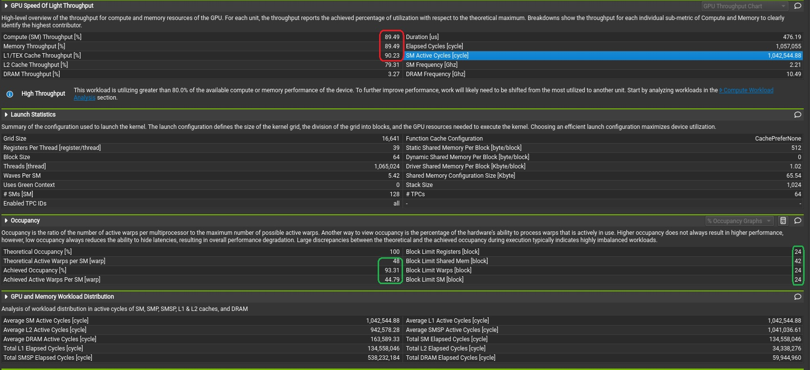
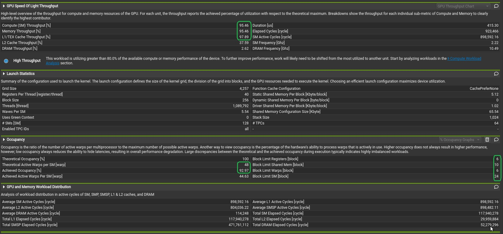

# Perf tune the Matrix Multication in CUDA. 

This repo touches some very important aspect of CUDA perfomrance tuning. 
- Divergence
- Occupancy
- Memory Coalesing
- Profiling
- Compiler directives and switches

It gives a step-by-step demo on how to iterate for better code for CUDA.

## Baseline
Like Linear Algera is the mathmetical foundation for Deep Learning, Matrix Multication is the soul of CUDA computation. Let's use this case study to optimize the performance for MatMul. 

We start with the standard tiled implementation [tiled_matmul.cu](./tiled_matmul.cu). TILE_SIZE is set to 32 as is recommended by many docs and posts. Let's benchmark it and use it as a baseline for our further perfomrance tuning. All the tests are done on my RTX 4090. I use 1024 and 1025 for the matrix dimensions so we can test the performance for when it is aligned with the TILE_SIZE and when it is not.


| CPU/GPU | M    | N    | K    | TILE_SIZE | Runtime(ms) |
|---------|------|------|------|-----------|-------------|
| C       | 1024 | 1024 | 1024 | n/a       | 2368233     |
| C       | 1025 | 1025 | 1025 | n/a       | 2352829     |
| G       | 1024 | 1024 | 1024 | 32        | 725         |
| G       | 1025 | 1025 | 1025 | 32        | 790         |


## Overcome the Divergence
Compared to the CPU version it has thousands of folds perf improvement. But is this the best we can do? Let's take a look at the code. CUDA executes code in warps (a group of 32 threads). Basically these threads execute SIMD (single instruction multiple data). This is all good if the code doesn't branches, but once different threads need to execute different branches, it diverges and causes inefficiencies. 

```cuda
        if (row < M && aCol < K) {
            sharedA[ty][tx] = A[row * K + aCol];
        } else {
            sharedA[ty][tx] = 0.0f;
        }

        if (bRow < K && col < N) {
            sharedB[ty][tx] = B[bRow * N + col];
        } else {
            sharedB[ty][tx] = 0.0f;
        }
```

We need to get rid of these branches in the kernel. The obvious solution is to pad the matrics to align with the TILE_SIZE. We did that in the [./tiled_matmul_padded.cu]

```cuda
    for (int tile = 0; tile < (K + TILE_SIZE - 1) / TILE_SIZE; ++tile) {
        sharedA[ty][tx] = A[row * K + tile * TILE_SIZE + tx];
        sharedB[ty][tx] = B[(tile * TILE_SIZE + ty) * N + col];
        
        __syncthreads();
        
        //#pragma unroll
        for (int k = 0; k < TILE_SIZE; ++k)
            sum += sharedA[ty][k] * sharedB[k][tx];
        
        __syncthreads();
    }
    
    C[row * N + col] = sum;

```

With the improved code, we see improved performance. Very good.

| CPU/GPU | M    | N    | K    | TILE_SIZE | With Padding | Runtime(ms) |
|---------|------|------|------|-----------|--------------|-------------|
| C       | 1024 | 1024 | 1024 | n/a       | no           | 2368233     |
| C       | 1025 | 1025 | 1025 | n/a       | no           | 2352829     |
| G       | 1024 | 1024 | 1024 | 32        | no           | 725         |
| G       | 1025 | 1025 | 1025 | 32        | no           | 790         |
| G       | 1024 | 1024 | 1024 | 32        | Yes          | 721.6       |
| G       | 1025 | 1025 | 1025 | 32        | Yes          | 770.2       |

## Profile and Analysis
Padding to avoid divergence does work, but is this the best we can do with CUDA? Let's profile it and find out. I use ncu to profile it, and use Nsight to see the report. 


The problem is we don't have full occupancy - it runs at 66.7%. And it causes low SM Compute throughput 77.68%. And if we look deeper, we can see why the occupancy is low. The Block Limit Registers is 1, same as Block Limit Shared Mem, and Warps. 

This is because a 32x32 block size is too large. When we don't have enough active warps, GPU can't switch between them to hide memory latency. 

The solution is obvious, let's make block size small (8x8), so we can have better occupancy. 

## Small block/tile size for better occupancy. 
It is a small change to the code to set the TILE_SIZE from 32 to 8. However the performance didn't improve. In fact it dropped. 

| CPU/GPU | M    | N    | K    | TILE_SIZE | With Padding | Runtime(ms) |
|---------|------|------|------|-----------|--------------|-------------|
| C       | 1024 | 1024 | 1024 | n/a       | no           | 2368233     |
| C       | 1025 | 1025 | 1025 | n/a       | no           | 2352829     |
| G       | 1024 | 1024 | 1024 | 32        | no           | 725         |
| G       | 1025 | 1025 | 1025 | 32        | no           | 790         |
| G       | 1024 | 1024 | 1024 | 32        | Yes          | 721.6       |
| G       | 1025 | 1025 | 1025 | 32        | Yes          | 770.2       |
| G       | 1025 | 1025 | 1025 | 8         | Yes          | 807         |
| G       | 1024 | 1024 | 1024 | 8         | Yes          | 841         |

Runtime increased from 770.2ms to 807ms. 

## Memory Coalesing 
Since we have much smaller block size now, we can have 48 theoretical active warps, which increases the occupancy to 93.31%. This is good news, and as a result it also increased the SM Compute and memory throughput. 

L1 TEX memory throughput is at a 90.23%. How come it perfs worse? When GPU reads from global memory into shared memory, it reads in 128 bytes trunk. This is called memory coalesing. But since our block/tile width is 8. Every float is 4 bytes, so 8x4 is 32 bytes. That means for the 128 bytes GPU read, we are only using 1/4 of it. what a waste!



## Rectangular Tiles
We want to keep the block/tiles small, but in the same time make the memory coalesing optimal. i.e. we want to keep the block/tile width at 32, but thrink the block/tile height to 8. 

Here comes the rectanguar tile. We are separating the definition of TILE_SIZE into TILE_ROWS and TILE_COLS. And change the kernel to handle it. The full detail can be found in [tiled_matmul_padded_mem_coalese.cu](tiled_matmul_padded_mem_coalese.cu)

```cuda
    __shared__ float sharedA[TILE_ROWS][TILE_COLS];
    __shared__ float sharedB[TILE_COLS][TILE_COLS];

    float sum = 0.0f;

    const int numTiles = K / TILE_COLS;

    for (int t = 0; t < numTiles; t++)
    {
        int globalA_col = t * TILE_COLS + tx;
        sharedA[ty][tx] = A[row * K + globalA_col];

        const int LOADS_PER_THREAD = TILE_COLS / TILE_ROWS;

//#pragma unroll
        for (int i = 0; i < LOADS_PER_THREAD; i++) {
            int brow = ty + i * TILE_ROWS;     // expand TY across extra rows
            int bcol = tx;

            int globalB_row = t * TILE_COLS + brow;
            sharedB[brow][bcol] = B[globalB_row * N + col];
        }
```

## Third time is a charm
With rectangular tiles, we are combining the best of the two worlds. Optimal memory coalesing with small block size. And as a result we are seeing the best performance. 

| CPU/GPU | M    | N    | K    | TILE_SIZE | With Padding | Runtime(ms) |
|---------|------|------|------|-----------|--------------|-------------|
| C       | 1024 | 1024 | 1024 | n/a       | no           | 2368233     |
| C       | 1025 | 1025 | 1025 | n/a       | no           | 2352829     |
| G       | 1024 | 1024 | 1024 | 32        | no           | 725         |
| G       | 1025 | 1025 | 1025 | 32        | no           | 790         |
| G       | 1024 | 1024 | 1024 | 32        | Yes          | 721.6       |
| G       | 1025 | 1025 | 1025 | 32        | Yes          | 770.2       |
| G       | 1025 | 1025 | 1025 | 8         | Yes          | 807         |
| G       | 1024 | 1024 | 1024 | 8         | Yes          | 841         |
| G       | 1025 | 1025 | 1025 | 8x32      | Yes          | 758         |
| G       | 1024 | 1024 | 1024 | 8x32      | Yes          | 727         |

Looks like we have a winner. for x1025 matrics, we have dropped the runtime to 758ms. And if we look at the profiling details, we are achieving 92.97% occupancy. Block number are 6, which is falling between the recommended of 6 to 12 for my RTX 4090. SM Compute/Memory Throughput is at 95.46%. Everything is running as it should.



## Final steps
We have fine tuned our code to best levarege the GPU features. There are still somethings we could do with the compiler for more efficent instructions generation. '-use_fast_math -O3' are the common ones to optimize the binary. And you can uncomment out the '#pragma unroll' directives in the code to unroll the loops. 

nvcc -use_fast_math -O3 -o tiled_matmul_padded_mem_coalese tiled_matmul_padded_mem_coalese.cu