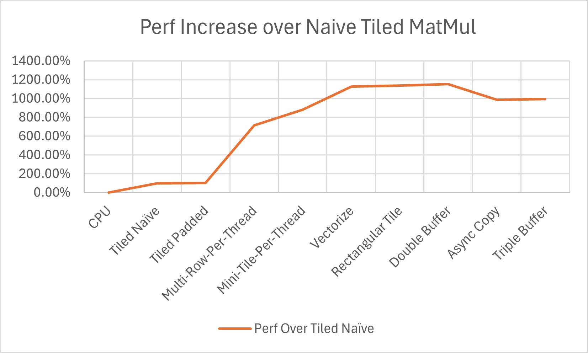

## This repo is to iterate from ground up to build a custom MatMul kernel in CUDA to achieve cuBlas level performance. 

The overall performance increase over the naive version of tiled MatMul is close to 12x folder. 

I've detailed the journey - write a kernel, test it, profile, find the bottleneck and fix it. Rinse and repeat. Sometimes an idea works, sometimes it doesn't. It doesn't matter. Keep grinding and we will eventually find something that works. 

It is broken down into two parts. The [first part](README.Part%20I.md) covers 
- Divergence
- Occupancy
- Memory Coalesing
- Profiling
- Compiler directives and switches

The [Second Part](README.Part%20II.md) covers
- Compute intensity
- Vectorization
- Double Buffering
- Async memory copy
- Triple Buffering

I hope enjoy reading it, I certainly enjoyed writing it. 